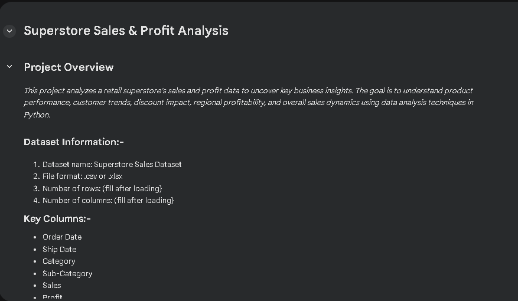
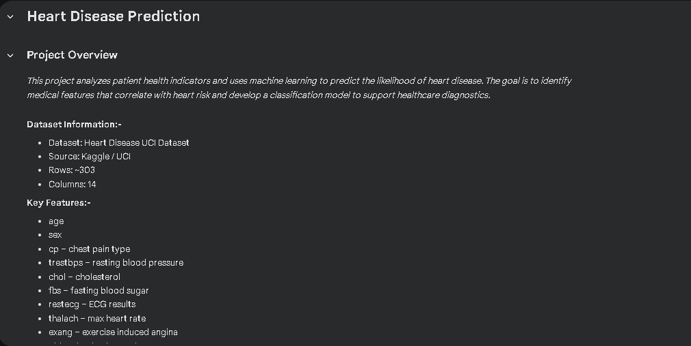
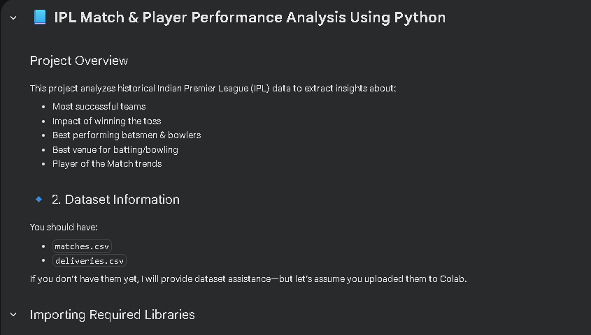
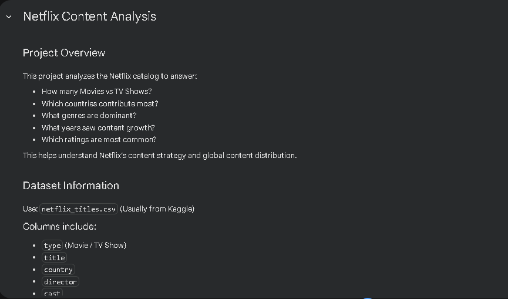
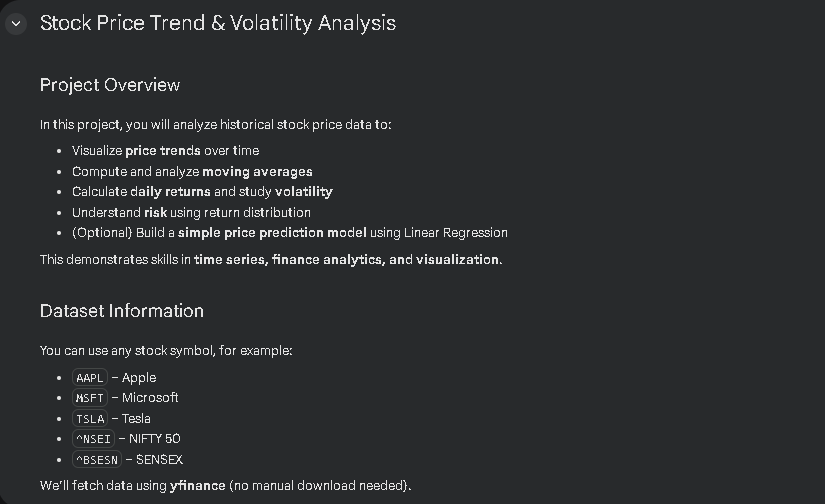

# 📊 Data Science & Machine Learning Portfolio

A collection of real-world data science & ML projects across multiple domains including retail, healthcare, sports analytics, entertainment, and financial time-series modeling.
All projects were completed using Python, Pandas, NumPy, Matplotlib/Seaborn, Scikit-Learn, and Google Colab.

---

## 🧠 Projects Included

### 🏪 1️⃣ Superstore Sales & Profit Analysis

**Domain:** Retail / Business Analytics  
**Objective:** Identify profit drivers, customer segments, discount impact & category performance.  

**Key Skills:**  
- Pandas data manipulation  
- EDA & visualization  
- Business insights & decision making  

👉 [View Project](./Superstore-Sales-Analysis/)

---

### ❤️ 2️⃣ Heart Disease Prediction (ML Classification)

**Domain:** Healthcare / Machine Learning  
**Objective:** Predict likelihood of heart disease using patient medical attributes.  

**Key Skills:**  
- Data preprocessing & feature engineering  
- ML models: Logistic Regression, Random Forest  
- Model evaluation (accuracy, classification report)  

👉 [View Project](./Heart-Disease-Prediction/)

---

### 🏏 3️⃣ IPL Match & Player Performance Analysis

**Domain:** Sports Analytics  
**Objective:** Analyze IPL teams, player performance, venue statistics & toss impact.  

**Key Skills:**  
- Grouping & aggregation  
- Pattern discovery  
- Player and venue analytics  

👉 [View Project](./IPL-Analysis/)

---

### 🎬 4️⃣ Netflix Movies & Shows Content Analysis

**Domain:** Entertainment / Media Analytics  
**Objective:** Analyze global content distribution, genre popularity, content growth trend.  

**Key Skills:**  
- Text splitting & processing  
- Country & genre analysis  
- Trend understanding over time  

👉 [View Project](./Netflix-Analysis/)

---

### 📈 5️⃣ Stock Price & Volatility Analysis

**Domain:** Finance / Time Series  
**Objective:** Analyze price trends, moving averages, volatility, and basic predictive modeling.  

**Key Skills:**  
- Time-series data manipulation  
- Moving averages & rolling statistics  
- Optional regression-based price prediction  

👉 [View Project](./Stock-Analysis/)

---

## 🛠️ Tech Stack

✔ Python  
✔ Pandas, NumPy  
✔ Matplotlib, Seaborn  
✔ Scikit-Learn  
✔ yfinance  
✔ Google Colab / Jupyter Notebook  
✔ Git & GitHub  

## 🎯 Goals of This Portfolio

✔ Demonstrate practical data analysis skills  
✔ Show ability to generate insights from real datasets  
✔ Demonstrate ML capabilities for classification & forecasting  
✔ Showcase domain versatility (business, health, sports, entertainment, finance)  
✔ Serve as a strong portfolio for job interviews & internship evaluations  

## 👨‍💻 About the Developer

Hi, I’m **Aditya Vishwakarma**, passionate about data science, analytics, and real-world problem solving using Python.
I enjoy working with datasets to uncover patterns, trends, and business insights.

If you'd like to connect, feel free to reach out:

💼 LinkedIn: https://www.linkedin.com/in/imadityavk
🐙 GitHub: https://github.com/cyberfortify
📧 Email: work.aditya2010@gmail.com  

## 📌 Future Enhancements

🔹 Deploy ML models as web apps  
🔹 Add dashboards (Power BI / Tableau / Streamlit)  
🔹 Explore deep learning and NLP projects  
🔹 Add more domain datasets  

If you like the work, consider ⭐ starring the repo! 😊  